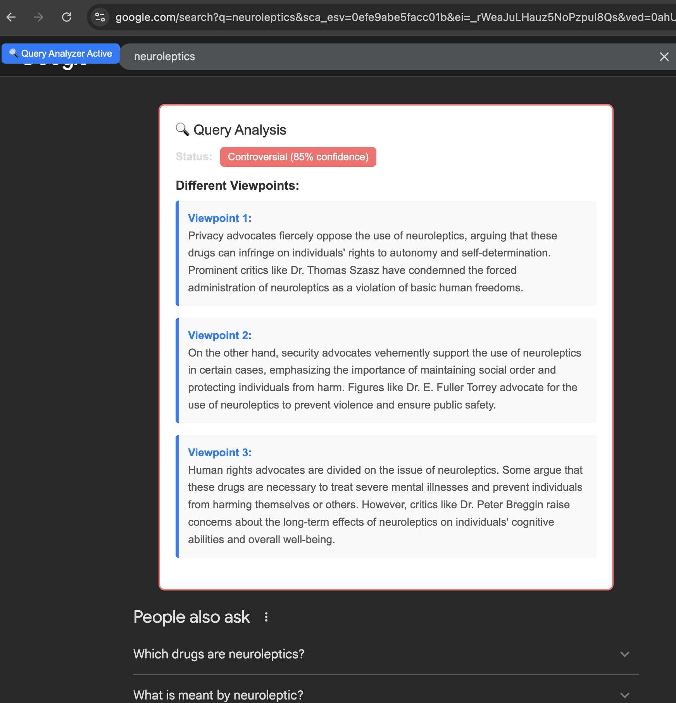
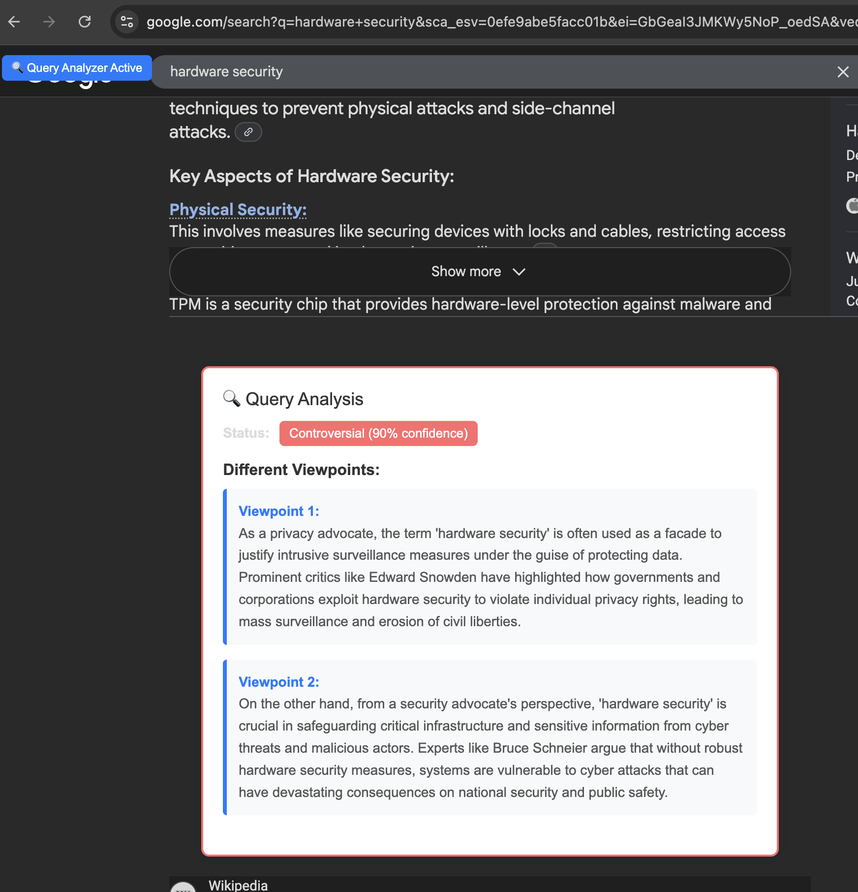

# Query Analyzer Chrome Extension

A Chrome extension that automatically detects and analyzes queries for controversial topics using ChatGPT. The extension provides real-time analysis of search queries and selected text, identifying controversial viewpoints and potential manipulation.


## Features

- **Automatic Query Detection**: Monitors search inputs and form submissions across websites
- **Text Selection Analysis**: Analyzes selected text that appears to be questions
- **Controversial Topic Identification**: Uses ChatGPT to determine if a topic is controversial
- **Multiple Viewpoints**: Provides 2-3 different perspectives on controversial topics
- **Manipulation Detection**: Identifies potential manipulation in queries
- **Real-time Overlay**: Shows analysis results in a floating overlay on web pages
- **Manual Testing**: Test queries directly from the extension popup

## Installation

### Prerequisites
- Google Chrome browser
- OpenAI API key (get one from [OpenAI Platform](https://platform.openai.com/api-keys))

### Steps

1. **Download or Clone** this repository to your local machine

2. **Replace Icon Files** (Optional):
   - Replace `icon16.png`, `icon48.png`, and `icon128.png` with your own icon files
   - Icons should be 16x16, 48x48, and 128x128 pixels respectively

3. **Load Extension in Chrome**:
   - Open Chrome and go to `chrome://extensions/`
   - Enable "Developer mode" (toggle in top right)
   - Click "Load unpacked"
   - Select the folder containing this extension

4. **Set Up API Key**:
   - Click the extension icon in your Chrome toolbar
   - Enter your OpenAI API key in the popup
   - Click "Save API Key"

## Usage

### Automatic Detection
The extension automatically monitors:
- Search inputs on websites (Google, Bing, etc.)
- Form submissions with query fields
- Text selections that appear to be questions

When a query is detected, the extension will:
1. Show a loading indicator
2. Send the query to ChatGPT for analysis
3. Display results in a floating overlay

### Manual Testing
1. Click the extension icon in your Chrome toolbar
2. Enter a query in the "Test Query" section
3. Click "Analyze Query" to get results

### Analysis Results
The extension provides:
- **Controversial Status**: Whether the topic is considered controversial
- **Confidence Level**: How confident the AI is in its assessment
- **Explanation**: Why the topic is considered controversial or not
- **Different Viewpoints**: 2-3 perspectives on controversial topics
- **Manipulation Indicators**: Signs of potential manipulation in the query

## API Response Format

The extension expects ChatGPT to return JSON in this format:

```json
{
  "isControversial": true,
  "confidence": 0.85,
  "controversialViewpoints": [
    "As a privacy advocate, I am deeply concerned that this technology represents an unprecedented invasion of personal autonomy and creates a surveillance state that undermines fundamental democratic principles. I believe the collection of such intimate data without explicit, informed consent violates the basic human right to privacy and sets a dangerous precedent for government overreach that we cannot afford to ignore.",
    "As a human rights advocate, I recognize that while privacy concerns are valid, this technology could save countless lives and prevent human rights violations by identifying patterns of abuse and discrimination. I firmly believe the potential benefits to vulnerable populations outweigh the privacy trade-offs, especially when proper safeguards and oversight mechanisms are in place to protect individual rights."
  ],
  "manipulationDetected": false,
  "manipulationIndicators": []
}
```

## Configuration

### Permissions
The extension requires:
- `activeTab`: To access the current tab
- `storage`: To save API key
- `scripting`: To inject content scripts
- `https://api.openai.com/*`: To make API calls to OpenAI

### Customization
You can modify the analysis prompt in `background.js` by editing the `prompt` variable in the `checkControversialTopic` function.

## Troubleshooting

### Common Issues

1. **"OpenAI API key not set"**
   - Make sure you've entered and saved your API key in the extension popup

2. **"API request failed"**
   - Check your internet connection
   - Verify your API key is valid
   - Ensure you have sufficient OpenAI credits

3. **Extension not detecting queries**
   - Refresh the webpage
   - Check if the website uses non-standard input names
   - Try manually testing a query from the popup

4. **Overlay not appearing**
   - Check if the website has CSS that might interfere
   - Try refreshing the page
   - Check browser console for errors

### Debug Mode
To enable debug logging:
1. Open Chrome DevTools
2. Go to the Console tab
3. Look for messages from the extension

## Security & Privacy

- Your API key is stored locally in Chrome's storage
- Queries are sent to OpenAI's servers for analysis
- No data is stored or transmitted to other servers
- The extension only accesses the current tab when needed

## Development

### File Structure
```
├── manifest.json          # Extension configuration
├── background.js          # Service worker for API calls
├── content.js            # Content script for webpage interaction
├── popup.html            # Extension popup interface
├── popup.js              # Popup functionality
├── icon16.png            # 16x16 icon
├── icon48.png            # 48x48 icon
├── icon128.png           # 128x128 icon
└── README.md             # This file
```

### Making Changes
1. Edit the relevant files
2. Go to `chrome://extensions/`
3. Click the refresh icon on the extension
4. Test your changes

## License

This project is open source. Feel free to modify and distribute as needed.

## Contributing

Contributions are welcome! Please feel free to submit issues and pull requests.

## Support

If you encounter any issues or have questions, please create an issue in the repository. 